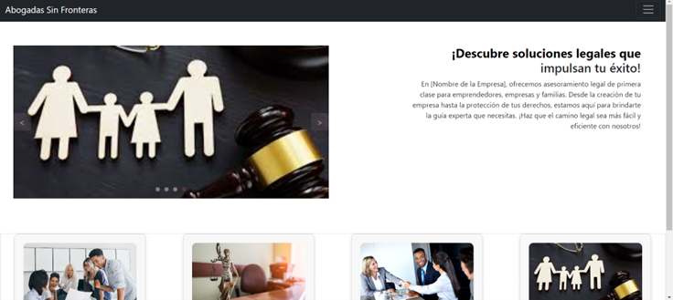

# evidencias_DayanaOtagri_2627060

## GA6-220501096-AA4 - Generar plantillas y estilos
En el proyecto, la carpeta `LawyerPage` contiene los siguientes componentes que componen la página web:
- Card
- Navbar
- Form
- Carrusel

## API GA7-220501096-AA5-EV02
Dentro del proyecto, se encuentra una carpeta llamada `mail` que contiene toda la lógica del servicio, permitiendo enviar la información suministrada al correo del cliente.

## Módulos integrados GA8-220501096-AA1-EV02
Dentro del proyecto, en la carpeta `LawyerPage`, el componente `email.service.ts` del frontend consume el endpoint que expone el backend.

## Codificación de módulos del software según requerimientos del proyecto GA7-220501096-AA2-EV01
El proyecto, en la carpeta `LawyerPage`, contiene los siguientes componentes que componen la página web:
- Card
- Navbar
- Form
- Carrusel

## Componente front-end del proyecto formativo y proyectos de clase GA7-220501096-AA4-EV03
En el proyecto, la carpeta `LawyerPage` contiene los siguientes componentes que componen la página web:
- Card
- Navbar
- Form
- Carrusel

## Diseño y Desarrollo de servicios web - proyecto GA7-220501096-AA5-EV03
El proyecto, en la carpeta `LawyerPage`, contiene los siguientes componentes que componen la página web:
- Card
- Navbar
- Form
- Carrusel

## Taller sobre codificación de módulos del software GA9-220501096-AA1-EV01
El proyecto, en la carpeta `LawyerPage`, contiene los siguientes componentes que componen la página web:
- Card
- Navbar
- Form
- Carrusel

